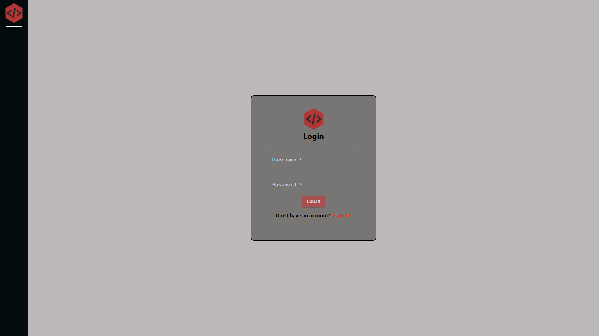

<!-- TITLE -->
<div align="center">

<h1>Disnode</h1>
<p>A real-time app for finding and connecting with communities sharing similar interests as you, making friends in the process - inspired by Discord.</p>

<p>Built with 
<a href="https://reactjs.org/">ReactJS</a>,
<a href="https://nodejs.org/en/">Node.js</a>, 
<a href="https://expressjs.com/">Express</a>, 
<a href="https://www.postgresql.org/">PostgreSQL</a>, 
<a href="https://mui.com/">Material-UI 5.3</a>, 
<a href="https://socket.io/">Socket.IO</a>,
<a href="https://aws.amazon.com/s3/">AWS (S3)</a>, 
and hosted with 
<a href="https://www.netlify.com/">Netlify</a> & 
<a href="https://www.heroku.com/">Heroku</a></p>

<b><a href="http://disnode.hirzalla.ca/" target="_blank">
» View Live Demo «
</a></b>

</div>

<!-- INTRODUCTION -->

## 📚 Introduction

<b>[Disnode](http://disnode.hirzalla.ca/)</b> is a full-stack application that allows members to create or join existing servers, connecting with others that share similar interests.

The idea of Disnode came from my love for online communities and game servers. I spend a lot of my time gaming with my friends, and we use Discord to do that. With my newly obtained knowledge from studying hard during my Bootcamp, I decided it would be super cool to make my own version of Discord. This is where the idea of Disnode came from, Discord but on Node (HAH! get it? sorry I had to).

### 🤝 **Collaborators**:

Each member focused mainly on different parts for this project, while also familiarizing each other with the rest of the application for context (we made sure everyone implemented at least a couple functionalities from backend to frontend).

- Adam Hirzalla ([**@adamhirzalla**](https://github.com/adamhirzalla)) - _Back-end (server and API routes), DB Architecture (ERD/Schema/Queries + shaping data), Sockets (server + client), AWS-S3 (server + client) & Front-end (React Contexts/Reducers + refactors)_
- Hyunsu Kim ([**@EavanK**](https://github.com/EavanK)) - _Middleman for backend/frontend (wire-ups), Front-end (React States/components), User Authorization - JWT (server + client) & API_
- Jonathan Su ([**@hjonsu**](https://github.com/hjonsu)) - _Front-end (styling/design), MUI components & Wireframes_

> This app was created as part of our final project for Lighthouse Labs - Web Development Bootcamp. The goal was to create a full-stack application from start to finish in just two weeks.

## ⚛️ Stack and Tools

- <b>Frontend</b>:
  <a href="https://reactjs.org/">ReactJS</a>,
  <a href="https://mui.com/">Material-UI 5.3</a>,
  <a href="https://socket.io/">Socket.IO</a>,
  <a href="https://aws.amazon.com/s3/">AWS (S3)</a>
- <b>Backend</b>:
  <a href="https://nodejs.org/en/">Node.js</a>,
  <a href="https://expressjs.com/">Express</a>,
  <a href="https://www.postgresql.org/">PostgreSQL</a>,
  <a href="https://socket.io/">Socket.IO</a>,
  <a href="https://aws.amazon.com/s3/">AWS (S3)</a>
- <b>Deployment</b>:
  <a href="https://www.heroku.com/">Heroku</a>
  (database API), <a href="https://www.netlify.com/">Netlify</a> (production client)

<!-- FEATURES -->

## ⭐ Features

- Real-time events for almost all features (sockets)
- Members can customize their profiles, and add connections to their socials or other platforms, which other members can view
- Members can create or join multiple servers
- Members can search for existing servers through title/invite codes/tags, or browse through a list of all servers
- Each server can have as many channels, each having its own messages instance (used for categorization within a server)
- Members can add other members to their friends list
- Member role system (Owner, Admins, Users) with different permissions for each

## ✨ Special Features:

- Live seen-by feature for all messages
- Live online status indicator for server members
- Live tagging/mentioning other members in chat messages
- Live notifications for new messages and member tags/mentions
- Upload images, GIFs as profile pictures and server logos
- View other members' profiles and view their linked connections
- Members can accept/reject incoming friend requests, or cancel outgoing requests
- Server Admins can kick members from server, create/edit/delete server channels, and delete chat messages for moderation purposes
- A server Owner can promote members to Admins, pass down ownership to an Admin, and edit server settings
- Each role has different role colors which are used for chat messages to quickly identify the role of the sender by color
- Members can copy server invite codes to clipboard and share it with other members to find and join the server

<!-- ## 🛠 Installation

The project is live
<b><a href="http://disnode.hirzalla.ca/" target="_blank">here</a></b>, but if you would prefer a local installation:

1. Clone or download this repository
   ```
   git clone https://github.com/adamhirzalla/charter
   ```
2. Create a `.env` by using `.env.example` as a reference: `cp .env.example .env`
3. Update the `.env` file with your correct local psql information

   - username: `labber`
   - password: `labber`
   - database: `midterm`
   <!-- 2. Set up and run the API server


   - See [README](https://github.com/adamhirzalla/charter-api)

4. Navigate to the project directory and install dependencies `cd charter && npm i`
5. Fix to binaries for sass: `npm rebuild node-sass`
6. Reset database: `npm run db:reset`
   > Check the db folder to see what gets created and seeded
7. Run the development server: `npm run local`
   > Nodemon is used, so you should not have to restart your server
8. Visit <a href="http://localhost:8080/">http://localhost:8000/</a> on your browser -->

## 📷 Screenshots

The project is live
<b><a href="http://disnode.hirzalla.ca/" target="_blank">here</a></b>





<!-- ## Dependencies

- [Node 10.x or above](https://nodejs.org/en/)
- [Express 4.x or above](https://expressjs.com/)
- [NPM 5.x or above](https://docs.npmjs.com/)
- [PG 8.5 or above](https://node-postgres.com/)
- [Cookie Session 1.4 or above](https://www.npmjs.com/package/cookie-session)
- [Chalk 2.4 or above](https://www.npmjs.com/package/chalk)
- [Morgan 1.9 or above](https://www.npmjs.com/package/morgan)
- [Dotenv 2.0 or above](https://www.npmjs.com/package/dotenv)
- [jQuery 3.6 or above](https://jquery.com/)
- [EJS 2.6 or above](https://ejs.co/)
- [Sass 1.3 or above](https://sass-lang.com/)
- [Bootstrap 5.1](https://getbootstrap.com/)

## Resources

- [Unsplash](https://unsplash.com/)
- [Flaticon](https://www.flaticon.com/)
- [Font Awesome](https://fontawesome.com/)
- [SVG Repo](https://www.svgrepo.com/) -->
